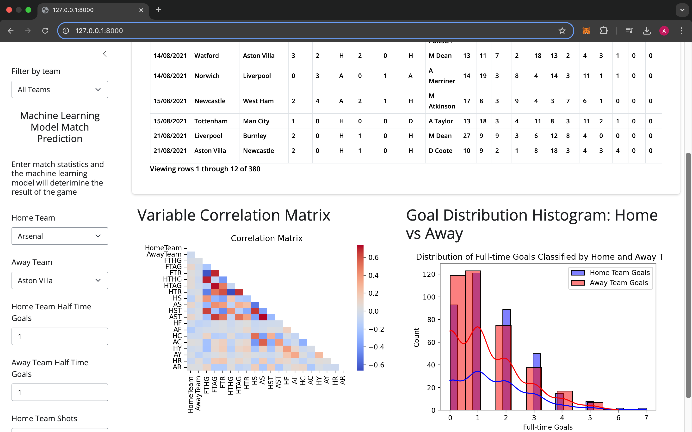

# Data Visualisation Dashboard - Premier League 2021/22 Match Data

This project provides a data visualisation dashboard based on the 2021/22 Premier League match data. The dashboard offers insighrs into team performance, and predicitive analytics.



## Installation

1. Clone the repository
```bash
git clone https://github.com/adamg14/football-data-dashboard.git
cd football-data-dashboard

```

2. Create and activate a virtual environment (optional)
```bash
python3 -m venv venv
source venv/bin/activate
```

3. Install the required dependencies
```bash
pip install -r requirements.txt
```

## Usage
After installation, you can run the dashboard locally
```bash
shiny run app.py
```
This will start the running of the dashboard, and you can access it via your web browser.

## Repository Breakdown
- [app.py](app.py) = The main application script that initialises and run the dashboard.
- [PL_REFEREE.py](PL_REFEREE.py) = Returns a list of the refrees based on the contents of the data frame.
- [PL_TEAM.py](PL_TEAMS.py) = A list of the premier league teams in the 2021/22 season.
- [data_exploration.py](data_exploration.py) = A script for initial data exploration, used to understand and preprocesses the dataset before analysis.
- [prediction_model.py](prediction_model.py) = Implements a machine learning mode to predict the outcome of a game based on match statistics, trained on the 2021/22 premier league match data.
- [read_data.py](read_data.py) = Handle data loading and preprocessing tasks, ensure that data is in the correct format analysis.
- [requirements.txt](requirement.txt) = Lists all Python dependencies required to run the project.
- models/ = A directory to store trained machine learning models, so retraining is not required.
